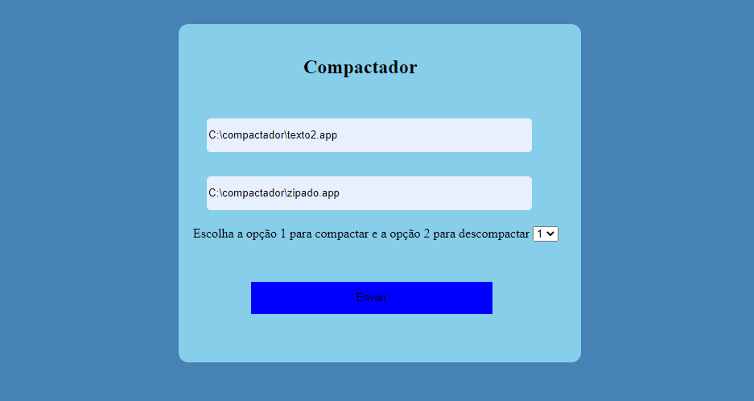

<h1>Compactador :lock:</h1>

<h1>Description and Funcionalities</h2>
This project aims to compress/decompress a text file only. When inserting a text, it shortens it, 
through the logic of putting some char character in front (ASCII). It unzips with the same logic,
taking the zipped file and replacing the ASCII characters with the number of times the normal 
character appears, remaining the same as the source file. This project was developed in:

<ul>
  <li>HTML</li>
  <li>CSS</li>
   <li>Java</li>

</ul>

<h2>How to use :books:</h2>
To have this project at home, you need to install some IDE, such as Eclipse. You will need to create a folder
with the name of "compress" and inside it put some text to be compressed, this text you can name as you want.
This project is web, so it needs to be created like that in the IDE, and initialized on the server.

<h2>Funcionalities :label:</h2>

<h2>Authors</h2>
Giovanna Cruz dos Santos(only me).
